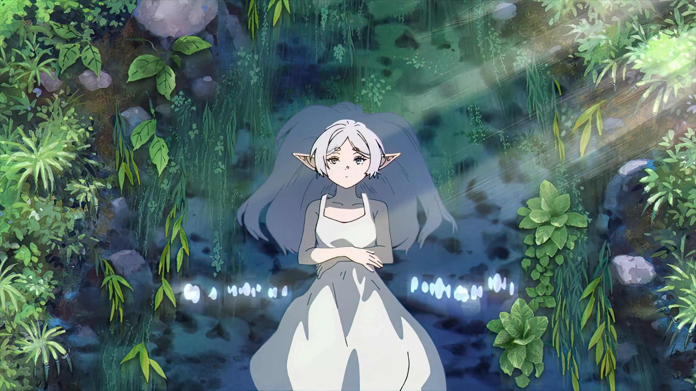

# Frieren Theme 

An Omarchy theme inspired by the anime **Frieren: Beyond Journey's End**.

The color palette was extracted directly from the anime wallpaper, capturing the cold blue tones, emerald forest greens, and the grayish white of Frieren's design.

---

## Color Palette

| Name          | Hex       | Usage                        |
|---------------|-----------|------------------------------|
| Background    | `#e3eadf` | Main background (light)      |
| Surface       | `#d4ddd0` | Surfaces, cards              |
| Text          | `#1d2837` | Main text                    |
| Accent        | `#2b4e55` | Highlight (cold blue)        |
| Green         | `#4b775e` | Emerald forest green         |
| Green Light   | `#6d9471` | Medium green                 |
| Stone         | `#6b8276` | Stone gray                   |
| Muted         | `#909a9a` | Secondary text               |

---

##  Installation

\`\`\`bash
omarchy-theme-install https://github.com/arthurr-jpg/frieren-theme-for-omarchy.git
\`\`\`

Or via menu: \`Super + Alt + Space\` → Install → Style → Theme

---

##  Preview



---

## Themed Apps

- Hyprland
- Kitty Terminal
- Ghostty Terminal
- Waybar
- GTK
- Neovim
- btop
- Mako (notifications)
- Hyprlock (lock screen)

---


---

## Post-Installation

To apply rounded corners to the lock screen password field, run:
```bash
sed -i 's/rounding = 0/rounding = 16/' ~/.config/hypr/hyprlock.conf
```
