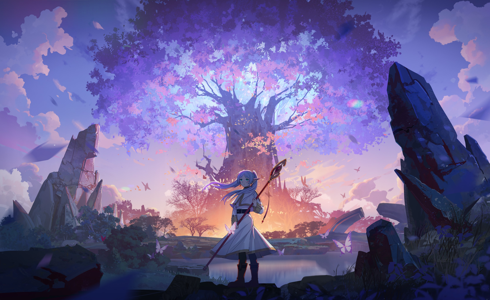
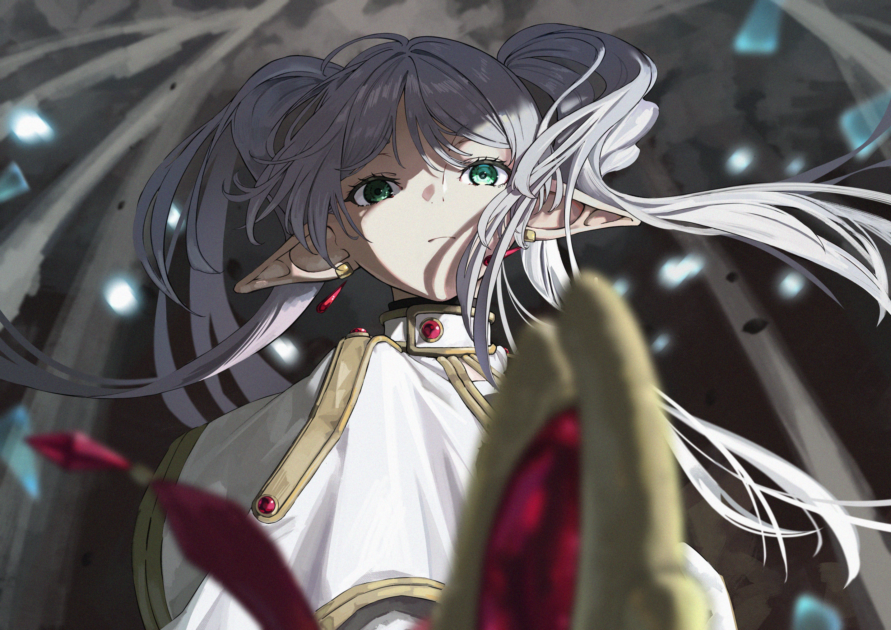
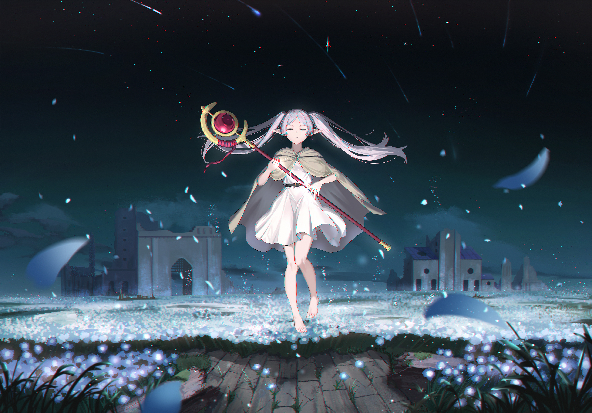
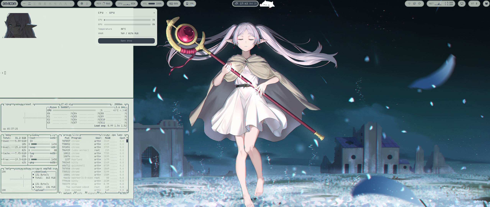
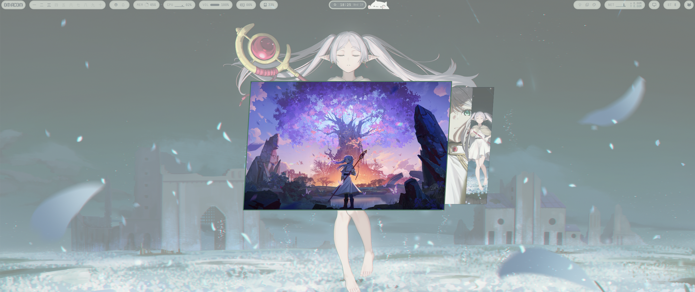
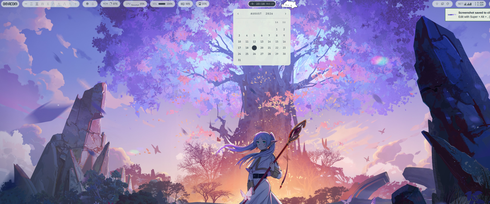

# Frieren Theme

An Omarchy theme inspired by the anime **Frieren: Beyond Journey's End**.

The color palette was extracted directly from the anime wallpaper, capturing the cold blue tones, emerald forest greens, and the grayish white of Frieren's design.

---

## Color Palette

| Name          | Hex       | Usage                              |
|---------------|-----------|-------------------------------------|
| Background    | `#e3eadf` | Main background (light)             |
| Surface       | `#d4ddd0` | Surfaces, cards                     |
| Overlay       | `#c2cfc0` | Soft overlay, module pills          |
| Text          | `#1d2837` | Main text                           |
| Subtext       | `#334247` | Secondary text                      |
| Muted         | `#475a58` | Muted text                          |
| Accent        | `#2b4e55` | Highlight (cold blue)               |
| Accent Light  | `#61727a` | Medium cold blue                    |
| Accent Soft   | `#909a9a` | Soft blue-gray                      |
| Green         | `#4b775e` | Emerald forest green                |
| Green Light   | `#6d9471` | Medium green                        |
| Green Soft    | `#a1b99c` | Soft pastel green (Waybar accents)  |
| Stone         | `#6b8276` | Stone gray                          |
| Slate         | `#395857` | Dark slate                          |
| Deep          | `#24414b` | Deep petrol blue                    |

---

## Installation

    omarchy-theme-install https://github.com/arthurr-jpg/frieren-theme-for-omarchy.git

Or via menu: `Super + Alt + Space` -> `Install` -> `Theme`

---

## Wallpapers

This theme ships with multiple backgrounds. Cycle between them with `Super + Ctrl + Space`.

| Preview | Name |
|---------|------|
|  | Floresta Eterna |
|  | Memoria de Himmel |
|  | Viagem ao Norte |

---

## Preview

---

## Themed Apps

- Hyprland
- Hyprlock (lock screen)
- Kitty Terminal
- Ghostty Terminal
- Alacritty
- Waybar - floating bar, pastel translucent module pills, no full-width background
- Walker (app launcher)
- SwayOSD (volume/brightness overlay)
- GTK
- Neovim
- btop
- Mako (notifications)

---

## Notes on the Waybar style

The bar itself has no background - only the functional modules (workspaces, clock, tray, battery, network, audio, active window title) render as soft pastel pills, letting the wallpaper show through the empty space. The active window title module uses light text on a darker pill for readability against the pastel palette.

---

"It took a long time to learn the magic that makes flowers bloom." - Frieren
